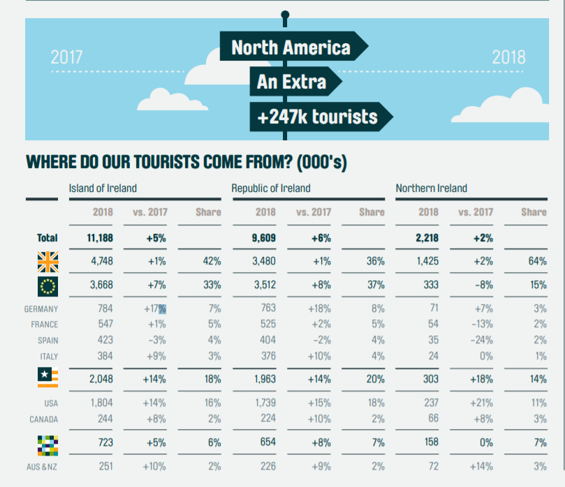
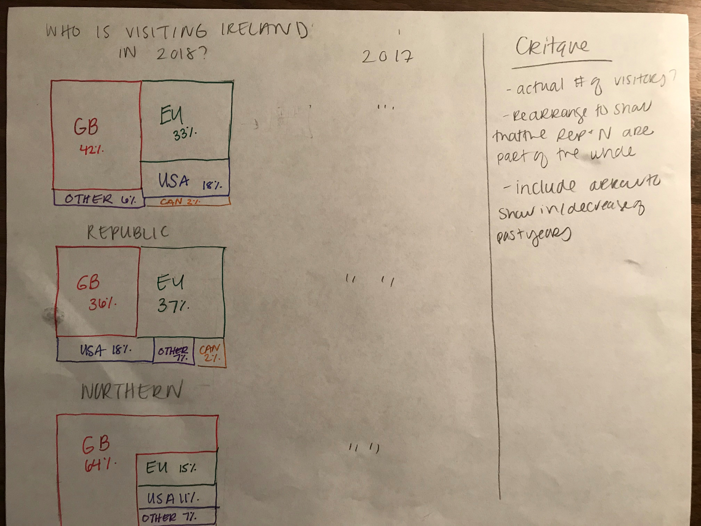
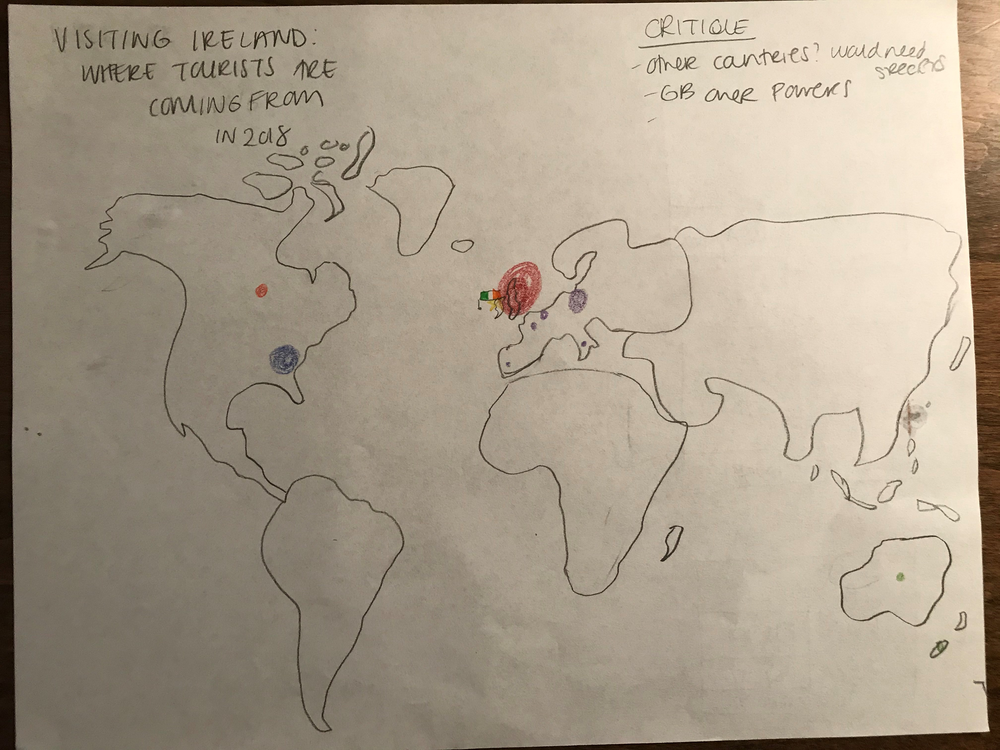

# Watters-Portfolio
This is my portfolio for the course Telling Stories with Data.

# About me
Hi, my name is Hannah Watters. I am a part-time student working towards a master's degree in public management. I started in the Heinz College in Spring 2020 and I hope to complete my degree in 2022. Outside of the online classroom, I work full-time at Carnegie Mellon in the Advancement Department as an assistant director of Advancement Research. In this position, I focus on prospecting Carnegie Mellon alumni and friends who may be interested in giving back to the institution. The role involves a lot of writing, creativity, strategy development, and more recently, data visualization. 

Before joining CMU in April 2019, I worked four years at the Carnegie Museums of Pittsburgh. My role at the museums also focused on prospect research and management. Originally from mid-central Ohio, I came to Pittsburgh to attend Duquesne University. At Duquesne, I earned a B.A. degree in art history and a minor in business. I currently live in Morningside with my husband and rambunctious pug, Remy.

# What I hope to learn
I hope to better my data visualization skills to help me excel in my professional career. The field of non-profit prospect development is evolving quickly. Many institutions are turning towards new technology to keep up with trends, such as BI software. I hope to learn how to create powerful data visualizations that are easy to interpret, especially to audiences who are reluctant to change (i.e. colleagues who keep paper records). I hope to gain from the course the confidence to present data in a powerful and productive way.

# Portfolio
This is where my data visualization projects with be stored. 

# Week 2 Assignment (/DatavizWeek2.md)

## General Government Debt from OCED
<iframe src="https://data.oecd.org/chart/65u1" width="860" height="645" style="border: 0" mozallowfullscreen="true" webkitallowfullscreen="true" allowfullscreen="true"><a href="https://data.oecd.org/chart/65u1" target="_blank">OECD Chart: General government debt, Total, % of GDP, Annual, 2018</a></iframe>

## Debt to GDP Througout the World - Line Chart

## Debt to GDP Throughout the World - Scatter Plot

### Line Chart vs. Scatter Plot
I thought the best way to present the data in a different form was through a scatter plot. The first change I made was rearranging the countries alphabetically to give some order to the data. By using a scatter plot, all the data is able to be presented in one chart rather than many (line), so it makes it easier for the reader to compare across countries. I also changed the y-axis to the years instead of the debt to GDP ratio. By having time as my y-axis, I was able to use a red-yellow-green coloring. This type of coloring is familar to audiences, knowing that red is "bad", yellow "better", and green "good". For example, by looking at the scatter plot the reader can easily identify that Japan's debt to GDP ratio has been getting consistently better, growing in the right (green) direction. Whereas Beligum started out higher (light green), then their ratio dipped (red/orange), and is now slowing improving (yellow). I also made sure to include a legend at the bottom of the chart so the color scale can be verfified. I  think that this data works well in an interactive scatter plot. By highlighting over the data points, which may be difficult to read at times, readers as able to see the specific readings.

# Assignment 3 & 4: Critique by Design

This chart belongs to a large PDF of charts and graphs from Tourism Ireland. The other graphs in the PDF display various facts and figures about Irish tourism. I selected this table because I thought there was be a better way to display the data. This orignal chart supplies the audience with the straight facts: where tourists are coming from and if country visitation increased from the previous year. 
There were some obvious things I liked about the table, such as listing the +/- symbols if visitation increased or decreased. Without having to even read the number, the reader can see the trend. Something I didn't like was how the countries were listed. I don't think it makes sense to list the EU, and then label four countries within the EU. Also, it lists North America, but only lists two countries within North America. 
#### Finding a Solution
The first fix I did was narrow down the categories to simply Great Britian, EU, USA, Canada, and other. Due to these simplified categories, I skteched out a tree map. Even by quickly sketching I could easily see where tourists were traveling from the most. I also made indidividual tree maps for the Republic and Northern Ireland to see about specific travel regionally. I thought it was still important to parse out these two groups because there are part of two different coutries. 

The second method I tried was a world heat map. While challenging to draw by free hand, I could tell right away it wasn't going to be a good fit. Since the makority of Ireland's visitors are from just a few specific regions, the map left a lot of dead space and Great Britian was really overcrowding Ireland. I also didn't like this method because of the "other categories." I wasn't sure where to place their representation.

#### Feedback
My feedback from others reinforced what I was already thinking. They were not fans of the heat map at all (and not just due to my poorly drawn map). One crtique about the tree map is they thought it was missing that +/- the original table portrayed, which is something I really liked about the orginal table. Both people also asked about exact numbers, how many were visiting. They thought the percentages were fine, but that they didn't necessarily add to the graphic.

#### Final Results
I used Flourish Studio to create my new graphs. Due to the multiple categories (countries), I used the deafault colors that Flourish provided because it they were all quite varied. I also added back in Aus/NZ since the original chart provided their numbers. Using the tree maps allow the reader to easily see where the tourists are coming from. The popup feature (hovering over the sections) tells the reader the number of visitors and how that number compares to the year before. By putting this info in a popup option, it takes a lot of text off the graph to make it cleaner. Once thing I would change is the layout of the three maps. Ideally, they would not be stacked on top of each other. I would have the main graph "Where to Ireland's tourists come from?" centered above and the two graphs showing the specifics (Republic vs. Northern) possibly smaller below it, since they both make the whole. Overall, I'm happy with my changes and I think it makes the information easier to digest. 

