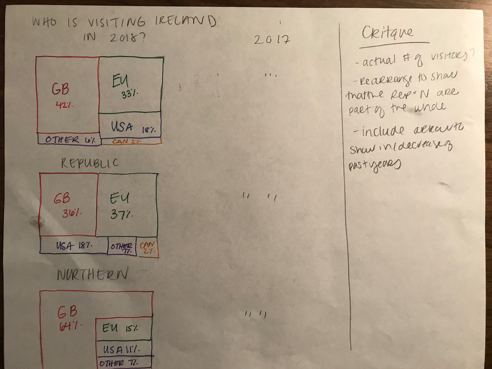

# Assignment 3 & 4: Critique by Design
#### Finding a visualization

This chart belongs to a large PDF of charts and graphs from Tourism Ireland. The other graphs in the PDF display various facts and figures about Irish tourism. I selected this table because I thought there was be a better way to display the data. This orignal chart supplies the audience with the straight facts: where tourists are coming from and if country visitation increased from the previous year. 
There were some obvious things I liked about the table, such as listing the +/- symbols if visitation increased or decreased. Without even having to actually read the number, the reader can see the trend. 
The first thing I knew I wanted to change was the amount of text - there are a lot on numbers listed in the table. It takes the reader a bit of time to parese through it all to make sense of it. I also found that the lines under the numbers were distracting. It made me wonder why the author didn't take the line across the whole table, why did it stop under each number? It makes it look clumpy. Finally, I also didn't like was how the countries were listed. I didn't think it make sense to list the EU, and then label four countries within the EU. Similarly, it lists North America, but only lists two countries within North America (USA and Canada). 
#### Finding a Solution
It took me awhile to process how I was going to transform the table. I spent some time reviewing the Glossary of Chart Types in the *Good Charts Work Book*. I debated putting the data into a line graph, but I wasn't sure how to make it clean. I was worried that since I was trying to show multiple categories over time it would be too chaotic. The first fix I did was narrow down the categories to simply Great Britian, EU, USA, Canada, and other. Due to these simplified categories, I skteched out a tree map. Even by quickly sketching I could easily see where tourists were traveling from the most. I also made indidividual tree maps for the Republic and Northern Ireland to see about specific travel regionally. I thought it was still important to parse out these two groups because there are part of two different coutries. 

The second method I tried was a world heat map. While challenging to draw by free hand, I could tell right away it wasn't going to be a good fit. Since the majority of Ireland's visitors are from just a few specific regions, the map left a lot of dead space and Great Britian was really overcrowding Ireland. I also didn't like this method because of the "other categories." I wasn't sure where to place their representation.

#### Feedback
My feedback from others reinforced what I was already thinking. They were not fans of the heat map at all (and not just due to my poorly drawn map). One crtique about the tree map is they thought it was missing that +/- the original table included, which is something I really liked about the orginal table. Both people also asked about exact numbers, how many were visiting. They thought the percentages were fine, but that it didn't necessarily add to the graphic.

#### Final Results
I used Flourish Studio to create my new graphs. Due to the multiple categories (countries), I used the default colors that Flourish provided because they were all quite varied. I also added back in Aus/NZ since the original chart provided their numbers. Using the tree maps allow the reader to easily see where the tourists are coming from. The popup feature (hovering over the sections) tells the reader the number of visitors and how that number compares to the year before. By putting this info in a popup option, it takes a lot of text off the graph to make it cleaner. Once thing I would change is the layout of the three maps. Ideally, they would not be stacked on top of each other. I would have the main graph "Where to Ireland's tourists come from?" centered above and the two graphs showing the specifics (Republic vs. Northern), possibly smaller below it, since they both make the whole. I think putting the Republic and Northern maps next to eachother would point out their differences about visitation. Overall, I'm happy with my changes and I think it makes the information easier to digest.

[Back to Homepage](/README.md)
