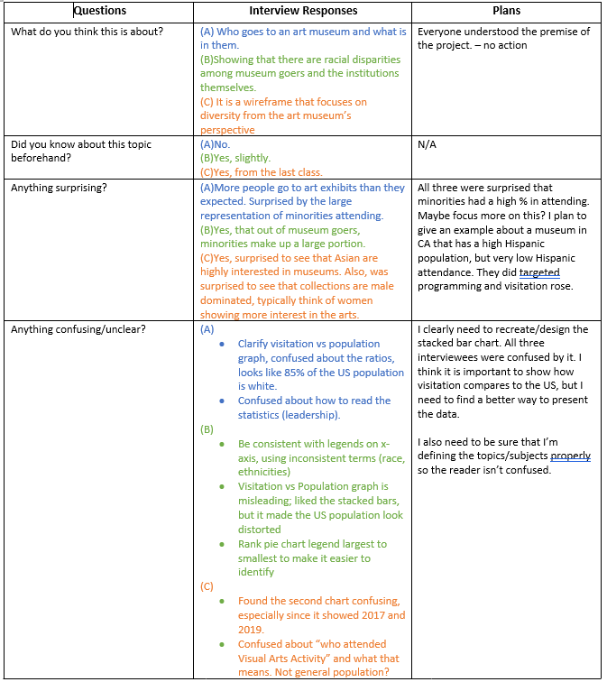
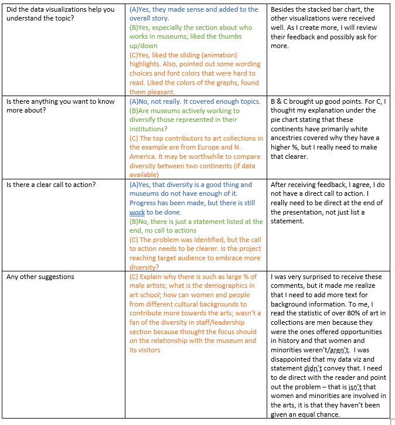

# Final Project, Part II
## Wireframing
[Check out my wireframe using Infogram](https://infogram.com/ocean-sand-1h8n6mm81lkg6xo?live)

I decided to use Infogram to create my wireframe and Flourish to make my data visualizations. I took elements from what I sketcted out for Part I and expanded on them. As I made my wireframe, I wanted to be sure that the way I presented my topic/story had a good flow. I started with an introductory fact to try and grab the reader's attention. The fact I chose highlights that a decent percentage of the U.S. population actively visits the arts. I then broke my wireframe into my three subtopics: visitation diversity, employment diversity, and collections diversity. 

I created a bar chart to show of those attending cultural events in the U.S., how many of those people are visiting museums specifically. I then created a second bar chart, but this time stacked, in order to show how museum visitation compares to the entire U.S. population. In my next section about diversity and employment, I chose to highlight two statistics that I thought were easy to interpret. I also included an example to show the audience the work in action. In the final section about museum collections, I chose to highlight the Met's collection in a pie chart. I plan on expanding this section in the final project to show that different type of museums are already working on correcting the issue at hand.

Overall, I was happy with the way my wireframe came together. I think it caputures the story I want to tell. I had some difficulty picking through my data. I came across a lot of great sources, but digging out the actual data proved challenging. Now that my data is more accessible, I plan on exapnding on my three subtopics and using more visulizations to make my call to action.

### Graphics
Below, you'll find drafts of some of my potential graphics for the final project that are included in my wireframe. The graphics are not interactive in Infogram, so check out the interactive ones below.

### Feedback
#### Target Audience
I hope to reach museum enthusiasts so show them the behind-the-scenes of how the museum is made. I also hope to reach people who live in communities with an accessible museum but do not visit. 
####  Identifying Individuals to Interview
**Target Audience**: I hope to reach museum enthusiasts so show them the behind-the-scenes of how the museum is made. I also hope to reach people who live in communities with an accessible museum but do not visit.
**Individuals to Interview**: I chose to interview three individuals: (A) I knew had no knowledge of the subject and little knowledge of data visualization methods; (B) knew a bit about the subject and is aware of data visualization methods; and finally a (C) classmate. 

[Back to Homepage](/README.md)

