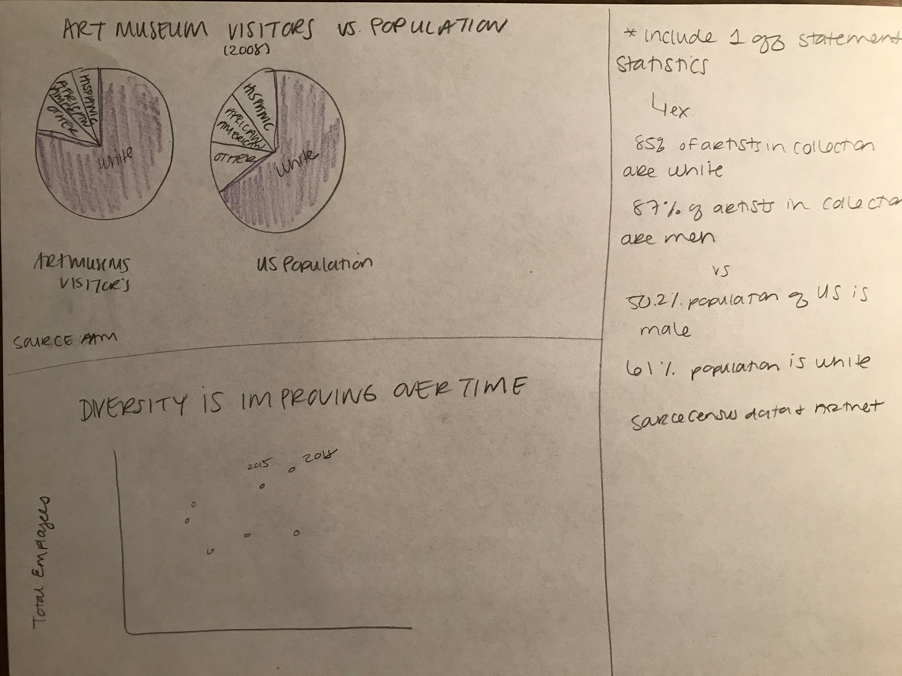

# Final Project

## Outline
Before my current job, I worked for a museum for four years. During this time I worked closely with the membership department where I became aware of the disparity of museum visitors and the cities in where they are located. Museum visitor demographics do not match the demographics across the United States. Visitors tend to be white and come from higher socioeconomic backgrounds. This is not reflective of the changes America is seeing, such as people that are white are predicted to become the minority population. I am interested in showing the reader who is visiting museums and how these current visitation numbers are predicted to change. I envision my call to action to be on how museums can lessen the divide, such as diversifying leadership and artists. I originally planned on picking a specific city (i.e. New York) and comparing its visitation to its community, but I was unable to find the data I needed. I have modified it to emcompass all museums and their visitors.

## Initial Sketches

## The Data
I plan on using information and data provided by the American Association of Museums (AAM). In 2010 they published a report with findings about past and present visitor demographics, as well as what they predicted for the future.

[Check out AAM's data](https://www.aam-us.org/wp-content/uploads/2017/12/Demographic-Change-and-the-Future-of-Museums.pdf)

Another source I plan to use is the Andrew W. Mellon Foundation. They recently did a project with museums across the country with providing grant moneies to increase diversity in leadership positions.

[Check out the Mellon's Foundation survey](https://mellon.org/news-blog/articles/latest-art-museum-staff-demographic-survey-shows-increases-african-american-curators-and-women-leadership-roles/#:~:text=ART%20MUSEUM%20STAFF%20DEMOGRAPHIC%20SURVEY%202018&text=Overall%2C%20the%20findings%20indicate%20that,and%20ethnically%20diverse%20since%202015.&text=Approximately%20430%20people%20of%20color,held%20by%20people%20of%20color.)

I will also use data to present real life situations that may be more relatable to the reader. Finally, I may present some data on costs of musuems and how it can present a barrier to entry.

## The Plan
I plan on using Shorthand to create my final project. Based on the demostration that Trista did in class, I think it will present my information well. I do not have any experience in Shorthand. Though it will be challenging, I think it will help me tell my story and call to action. I will use Tableau and Flourish to recreate my data visualizations. I will also most likely use images to go with my text and visualizations. 

At this point in the project, I need to narrow down my ideas a bit more. I worry that I may be easily over complicating the story I want to tell. Also, due to the large scale of the museum demographics, there are few studies that have been done in the past 10 years. I worry that my data may be "out of date." I hope to combat that potential issue with current population data and relatable stories.

As I type out my outline, my idea is already shifting to something a bit different than described above. To present a more persusive, complete story I may focus my project on diversity in art musuems, in all aspects - visitation, leadership, and artists in collections. I really want to show the readers that there is room and need for improvement for diversity in museums. By reaching out to local communities, to recruiting diverse hires, and adding diverse artists to their collections, museum can being to change their narrative of being excludive places. 

[Back to Homepage](/README.md)
